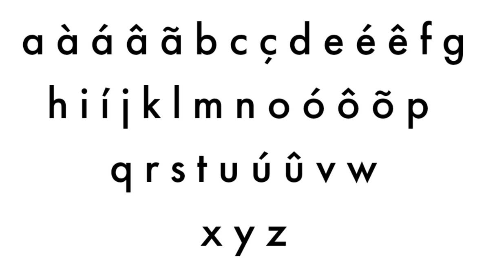

# Tự học Tiếng Đức

{:  style="display: block; margin: 0 auto; max-width:70%; height:auto;" }

Đây là một hướng dẫn (lộ trình) tự học Tiếng Đức thông qua Comprehensible Input (Nội dung dễ hiểu) và Immersion, *hoàn toàn miễn phí*.

Bạn sẽ cần thời gian. *Rất nhiều thời gian*. Không thể học một ngôn ngữ chỉ trong một tháng, ai nói vậy thì chỉ nói vớ vẩn thôi. Điều quan trọng là phải học **liên tục mỗi ngày**, hoặc ít nhất là gần như vậy. Bạn cần xây dựng thói quen tiếp xúc thường xuyên với ngôn ngữ, đó là cách duy nhất để tiến bộ thật sự. Có nhiều ước tính ngoài kia về tổng số giờ cần để học một ngôn ngữ. Khi mình dành nhiều thời gian hơn mỗi ngày, mình tiến bộ nhanh hơn -- đơn giản vậy thôi.

Bạn nên (*cần*) đọc [Hướng dẫn tự học ngoại ngữ đầy đủ này](https://daihocmo.github.io/ngoai-ngu/orca/giai-doan-0/) để hiểu về phương pháp học ngoại ngữ được trình bày trong trang này.

## Nền tảng

<iframe width="560" height="315" src="https://www.youtube.com/embed/39UDZMgPg5k?si=nZmyYhgR9yN4Nnxi" title="YouTube video player" frameborder="0" allow="accelerometer; autoplay; clipboard-write; encrypted-media; gyroscope; picture-in-picture; web-share" referrerpolicy="strict-origin-when-cross-origin" allowfullscreen></iframe>

### Bảng chữ cái

*Nhìn qua bảng chữ cái Tiếng Đức phát*

Làm quen với bảng chữ cái tiếng Đức và các âm đặc trưng như “ch”, “sch”, “ö”, “ü”.

<iframe width="560" height="315" src="https://www.youtube.com/embed/xYuPIQMvEsg?si=EOwI9T_QiOEwpHJ3" title="YouTube video player" frameborder="0" allow="accelerometer; autoplay; clipboard-write; encrypted-media; gyroscope; picture-in-picture; web-share" referrerpolicy="strict-origin-when-cross-origin" allowfullscreen></iframe>

### Về cơ bản thì

Mình sẽ tập trung vào những nền tảng cơ bản của việc học Tiếng Đức bằng cách:

- Học từ vựng thông dụng.
- Học những nguyên tắc cơ bản về cách ngôn ngữ hoạt động.

## Từ vựng

Anki là một trong những ứng dụng ôn tập từ vựng mình _yêu thích nhất_. Đây là app flashcard cho phép bạn dùng bộ thẻ có sẵn hoặc tự tạo của riêng mình! ([Bấm vào đây](https://youtu.be/6BJgxHC3Yuc?si=Bsxo_8IPK9Wy7Go2) để tìm hiểu thêm về Anki và cách sử dụng).

Mình sẽ dùng [Goethe Verlag](https://ankiweb.net/shared/info/293204297) trên Anki để học gần 1.000 từ phổ biến nhất trong truyền thông Tiếng Đức, rồi chuyển sang sentence mining (hay còn gọi là *đào câu*, đọc hướng dẫn về [Sentence Mining](/ngoai-ngu/sentence-mining/) để biết thêm chi tiết). Đây là kỹ thuật lấy từ và câu mới trực tiếp từ tài nguyên immersion bằng công cụ như [ASBplayer](https://chromewebstore.google.com/detail/asbplayer-language-learni/hkledmpjpaehamkiehglnbelcpdflcab?hl=en) ([Bấm vào đây](https://youtu.be/KxLRp1yd8Ro?si=cDGjOWdTygdl5ZpU) để xem hướng dẫn sentence mining bằng ASBplayer).

Một điều mà cá nhân mình gợi ý là dừng sentence mining sau 2-3.000 thẻ. Làm thẻ Anki rất dễ gây nghiện, và bạn có thể tạo đến 10.000 thẻ hoặc hơn. Nhưng thực tế, có quá nhiều thẻ như vậy _không_ hữu ích. Bạn chỉ cần số lượng từ phổ biến thường gặp, thay vì nhồi nhét tất cả.

## Ngữ pháp

[German Grammar Primer](https://zenith-raincoat-5cf.notion.site/German-Grammar-Primer-8ebe0eb747b442c18608b58f0a107787) là hướng dẫn học ngữ pháp Tiếng Đức nhanh (bằng Tiếng Anh). Một tài nguyên miễn phí khác mà dạy Tiếng Đức bằng Tiếng Việt là danh sách phát [Ngữ Pháp Tiếng Đức A1.1](https://www.youtube.com/playlist?list=PL5aBMauj57NuKkV9sVMUUiXGVsx_dnNZ_) hoặc [Ngữ pháp Tiếng Đức của DeutschFlex](https://www.youtube.com/playlist?list=PLEoRTUA8DxB5KN0MPZUWWNWnEaV-LvVkP)

## Comprehensible Input (Nội dung dễ hiểu)

Đây là loại input mà bạn **hiểu được phần lớn nội dung**, dù vẫn có một vài từ hoặc cấu trúc bạn chưa biết. Nhờ ngữ cảnh, hình ảnh, hoặc kiến thức sẵn có, bạn vẫn đoán được ý chung của câu hoặc đoạn văn. Theo thời gian, não bộ sẽ tự động liên kết những "mảnh ghép còn thiếu" với ý nghĩa phù hợp --- mà không cần phải dịch từng từ.

Nói cách khác: bạn không cần hiểu 100% mọi thứ. Chỉ cần hiểu đủ để theo kịp nội dung.

Đây chính là lý do Comprehensible Input rất hiệu quả: bạn tiếp xúc với ngôn ngữ trong ngữ cảnh thực tế, và từ vựng + cấu trúc mới được tiếp thu một cách tự nhiên.

Đây là một số ví dụ, bạn hãy thử xem video sau đây của [Deutsch mit Lari](https://www.youtube.com/@deutsch_mit_lari/videos):

<iframe width="560" height="315" src="https://www.youtube.com/embed/gl46OAObDtw?si=dbjM_Jd-X3Dy5dWc" title="YouTube video player" frameborder="0" allow="accelerometer; autoplay; clipboard-write; encrypted-media; gyroscope; picture-in-picture; web-share" referrerpolicy="strict-origin-when-cross-origin" allowfullscreen></iframe>

Bạn thấy thế nào, dễ hiểu không? Mình tin là kể cả bạn chưa học một từ vựng Tiếng Đức nào, bạn cũng có thể hiểu được kha khá nội dung trong video.

Các nguồn Comprehensible Input khác:

[Peppa Pig Tiếng Đức](https://www.youtube.com/channel/UCNclt7O1bO7hz8Mari68neg)

[Naturlich German](https://www.youtube.com/channel/UCsYGAmiWIvOjvT9f1sgQXRw/playlists)

[kathrin shechtman](https://www.youtube.com/playlist?list=PLO4l-x0dJROw6mRM_wC9253hZgn0wmzQu)

[Hallo aus Berlin](https://www.youtube.com/playlist?list=PLtnwp9jtWtvhXC1EIKJGNRhvwjCaAX_n_)

[Deutsch Direkt](https://www.youtube.com/playlist?list=PLsfkZZGbu8VT8y6L3YbFsfslp8CwzEvwl)

[Extr@ auf Deutsch](https://www.youtube.com/playlist?list=PLsfkZZGbu8VShZeYjcx0Zc8kJYmJN_aTJ)

## Immersion (Tiếp nhận ngôn ngữ)

Nếu bạn đã hoàn thành (hoặc gần xong) bộ thẻ từ vựng Tiếng Đức cơ bản ở trên đồng thời có một lượng hiểu ngữ pháp tương đối, chúc mừng bạn nha. Có thể hiện tại bạn đang cảm thấy gần như không hiểu bất kì nội dung nào ở ngoại ngữ mục tiêu của mình. Điều này là hoàn toàn bình thường. Bạn vẫn chưa tiếp thụ được nhiều kiến thức về ngôn ngữ đấy nhưng bạn đã học được tương đối rồi đấy.

Bây giờ là lúc bắt đầu hành trình thực sự. Bước này về cơ bản sẽ không bao giờ kết thúc vì càng tiêu thụ nội dung ngôn ngữ mục tiêu thì kĩ năng của bạn sẽ càng trở nên tốt hơn.

**Immersion. Immersion. Immersion**. Tiếp xúc với ngôn ngữ, *thật nhiều*.

<iframe width="560" height="315" src="https://www.youtube.com/embed/r5Qxr8OGkaA?si=m1iKHkXpHxo97u8T" title="YouTube video player" frameborder="0" allow="accelerometer; autoplay; clipboard-write; encrypted-media; gyroscope; picture-in-picture; web-share" referrerpolicy="strict-origin-when-cross-origin" allowfullscreen></iframe>

*xem thử video này của MattVSJapan cho có động lực nhé :> nhìn setup mà mê*

Phần việc chính trong toàn bộ quá trình học của bạn là: học từ vựng + ngữ pháp, rồi thực hành immersion sử dụng comprehensible input (hoặc nội dung Tiếng Đức mà bạn yêu thích).

Immersion là khi bạn tương tác với nội dung tự nhiên bằng ngôn ngữ mục tiêu (ở đây là Tiếng Đức). Là nội dung KHÔNG hề được làm hoặc chọn lọc kỹ càng cho người học mà được làm bởi chính người bản ngữ cho người bản ngữ (*Theo thuật ngữ thì được gọi là input, nhưng mình thích dùng immersion hơn*).

Bạn hãy thử xem tập Peppa Pig bằng Tiếng Đức sau đây, không cần xem hết cũng được (việc xem nội dung Tiếng Đức không phụ đề này chính là *immersion*, nhưng mà với người mới học thì sẽ không dễ hiểu lắm):

<iframe width="560" height="315" src="https://www.youtube.com/embed/lAn5oS9f3ZM?si=L1Cj48YbsLhHlTmt" title="YouTube video player" frameborder="0" allow="accelerometer; autoplay; clipboard-write; encrypted-media; gyroscope; picture-in-picture; web-share" referrerpolicy="strict-origin-when-cross-origin" allowfullscreen></iframe>

Bạn cũng cần bắt đầu xây dựng một bộ _mining deck_ (bộ thẻ mining). Một bộ thẻ mining là một bộ thẻ Anki bạn tự tạo mà khi thông qua các nội dung mà bạn tiêu thụ, bạn sẽ "đào" từ vựng từ câu mà bạn tiếp xúc trong lúc immerse. Việc tạo một bộ thẻ mining là một chủ đề lớn và sẽ được giải thích kĩ hơn ở bài viết [Mining](/ngoai-ngu/mining/). Bạn nên bắt đầu nghe ngoại ngữ càng sớm càng tốt. Bạn có thể tìm gợi ý nội dung để tiêu thụ ở trong trang [Tài nguyên](resources.md). Tìm nội dung bạn thích, bất kì thứ gì miễn là ở ngôn ngữ mục tiêu của bạn. Ban đầu, khả năng nghe của bạn sẽ kém hơn khả năng đọc rất nhiều. Và nếu có thể, thử đi tìm người bản ngữ để thực hành output (nói, viết) cùng. Sẽ thích hơn rất nhiều và cũng sẽ giúp cho bạn có động lực học.

### Xem nhiều chương trình TV để học Tiếng Đức

Bạn có thể tự học Tiếng Đức qua TV không? Có chứ! Học ngôn ngữ này qua TV HOÀN TOÀN khả thi—ngay cả khi bạn mới bắt đầu!

Nếu được làm lại từ đầu, mình sẽ xem TV sớm nhất có thể. Thực ra đây chính là một trong những điều mình đã làm, và mình chắc chắn sẽ làm lại nếu có cơ hội.

Mình đã xem hàng trăm giờ TV bằng Tiếng Đức. Mình nghĩ đây là một trong những lý do chính giúp mình tiến bộ nhanh như vậy. Đây là lý do vì sao xem TV rất hiệu quả:

- Nó giải trí! Các bộ phim mình xem có kinh phí lớn, chất lượng hình ảnh và âm thanh cao
- Nó dễ hiểu hơn vì mình vừa có thể đọc phụ đề, vừa nghe cảm xúc trong giọng nói, vừa nhìn những gì đang diễn ra trên màn hình!
- Mình được nghe Tiếng Đức _tự nhiên_, chứ không phải giọng nói chậm và cẩn thận như trong tài liệu cho người mới.
- Mình được tiếp xúc với nhiều giọng vùng miền khác nhau mà không bị rối.

Mình chắc chắn sẽ làm lại điều đó, bắt đầu với phim dễ rồi dần nâng cao, và điều này dẫn đến ý tiếp theo.

## Vậy thì tóm gọn lại, mình cần làm những gì để học Tiếng Đức?

1. Học bảng chữ cái Tiếng Đức.
2. Học [Bộ thẻ từ vựng 1K](https://ankiweb.net/shared/info/1124298719) để xây dựng vốn từ cơ bản trước khi immerse. Hãy học cách sử dụng Anki qua [Học viện Anki](https://ankivn.com/guides/). Bạn cũng nên cài [Yomitan](https://yomitan.wiki) (Firefox/Chrome) để có thể tra từ bằng cách di chuột.
3. Vì bạn sẽ học từ vựng song song với ngữ pháp, nên việc điều chỉnh tốc độ học là rất quan trọng. Điều này không có nghĩa là bạn không nên thử thách bản thân. Bạn có thể thay đổi số thẻ mới mỗi ngày trong Anki, nhưng hãy để mặc định trong vài ngày đầu để xem có phù hợp không. Tăng số thẻ nếu bạn thấy còn dư sức, và giảm nếu bạn cảm thấy quá tải (hoặc tự ép mình cố gắng hơn). Khi đã quen, tổng số thẻ cần ôn mỗi ngày thường gấp khoảng 10 lần số thẻ mới (ví dụ: 20 thẻ mới/ngày ≈ 200 thẻ ôn/ngày). Bạn nên đặt giới hạn trên cho số thẻ ôn mỗi ngày ở mức cao nhất có thể, vì việc bỏ lỡ ôn tập sẽ làm ảnh hưởng đến hệ thống lặp lại ngắt quãng (spaced repetition) của Anki. Nếu bạn không theo kịp, hãy giảm số thẻ mới thay vì giới hạn số thẻ ôn.
4. Để học ngữ pháp, mình gợi ý [Ngữ Pháp Tiếng Đức A1.1](https://www.youtube.com/playlist?list=PL5aBMauj57NuKkV9sVMUUiXGVsx_dnNZ_) hoặc [Ngữ pháp Tiếng Đức của DeutschFlex](https://www.youtube.com/playlist?list=PLEoRTUA8DxB5KN0MPZUWWNWnEaV-LvVkP) (Tìm được mỗi hai danh sách phát này :))).
5. Sau khi bạn đã học xong giáo trình ngữ pháp đã chọn, bạn có thể bắt đầu đọc Tiếng Đức. Mặc dù không bắt buộc, nhưng việc đọc sẽ dễ hơn nếu bạn đã đạt khoảng 1000--2000 từ vựng (bạn vẫn sẽ phải tra nhiều từ, nhưng sẽ đỡ vất vả hơn).
6. Ở giai đoạn này, hầu hết mọi người bắt đầu tạo cho mình một mining deck riêng. Đây là bộ từ vựng mà bạn thêm các từ mới mà bạn học được thông qua quá trình immersion. Bạn nên sử dụng [tích hợp Yomitan với Anki](https://yomitan.wiki), cho phép tạo thẻ Anki mới chỉ với một cú nhấp chuột ([hướng dẫn](https://yomitan.wiki/anki)).
7. Đọc nhiều hơn. Ban đầu việc đọc sẽ chậm, nhưng càng luyện tập bạn sẽ càng tiến bộ.
8. Tận hưởng những nội dung hấp dẫn.

## Từ giờ trở đi

Chà chà, chúc mừng nhé. Bạn đã hoàn thành chương trình này. Đến giai đoạn này, có lẽ bạn sẽ cảm thấy khá thoải mái với Tiếng Đức (và sẽ không còn là một ác mộng như thời còn mới học nữa). Bạn đã (hoặc gần như) đạt đến mức có thể "giao tiếp được". Bạn đã cảm thấy mình *bueno en español* chưa? Có lẽ là chưa. Nhưng điều đó có quan trọng không? Thật ra là không. Nếu bạn đã đi được đến đây, nghĩa là bạn thực sự yêu thích ngôn ngữ này, và sự lưu loát không còn là mục tiêu duy nhất nữa. Việc học Tiếng Đức giờ đã trở thành một phần trong lối sống của bạn, và miễn là bạn tiếp tục học từ mới, cụm từ mới, thành ngữ, v.v., bạn chắc chắn sẽ đạt đến trình độ mong muốn.

Hãy tiếp tục củng cố Tiếng Đức của bạn thông qua lượng lớn tiếp xúc, immersion và input (đầu vào) dễ hiểu (comprehensible input). Nếu có thể, thử đến bất kì đất nước nào nói Tiếng Đức (Đức, Thụy Sĩ, Bỉ) để trải nghiệm văn hóa gắn liền với ngôn ngữ bạn đang học (và tất nhiên là để luyện Tiếng Đức nữa).