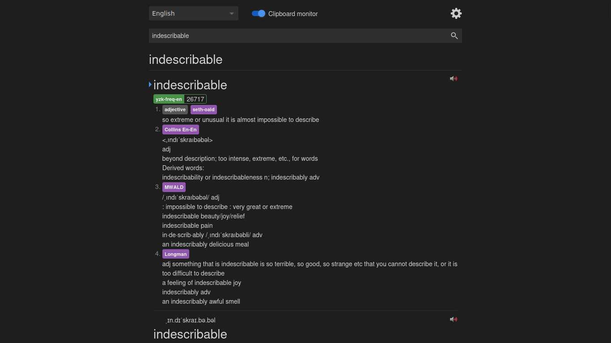
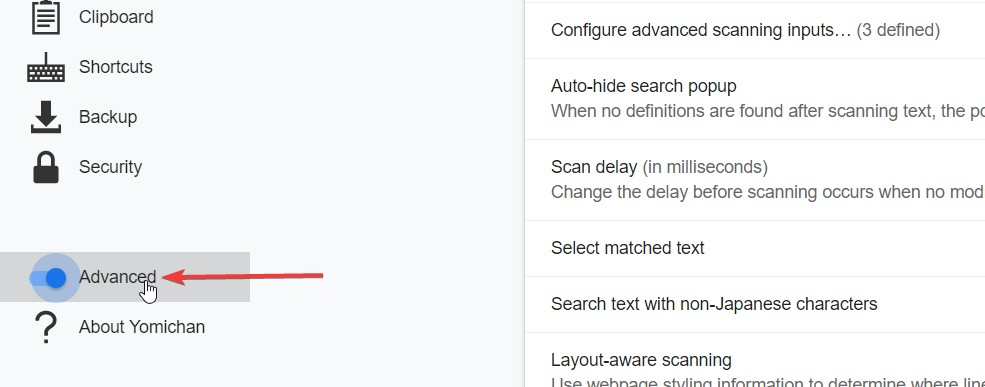
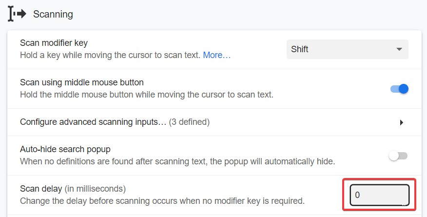
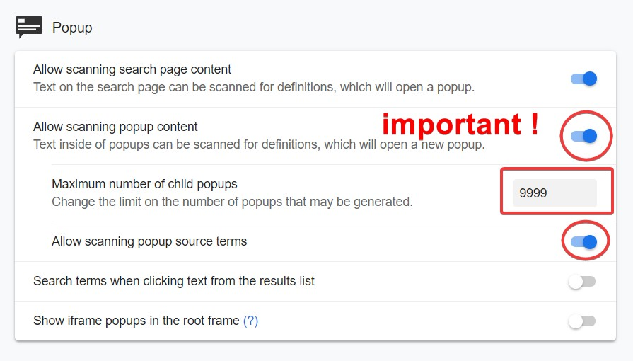
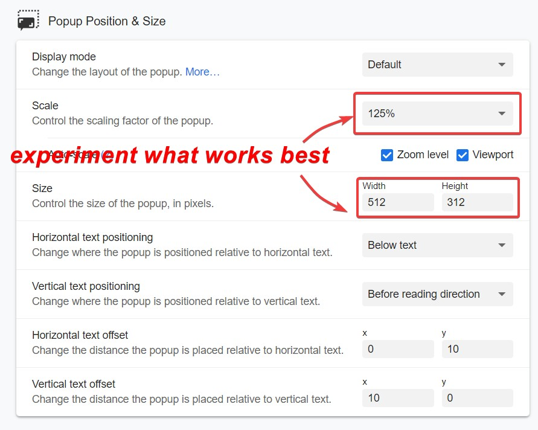
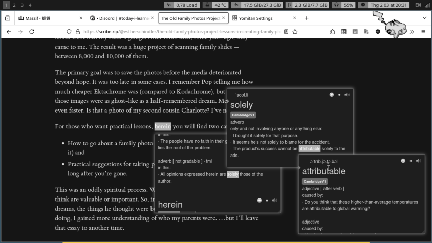
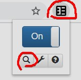

# Hướng dẫn học đơn ngữ

**Nhắc nhỏ**: Đây là hướng dẫn dành cho người học trung cấp.

Hướng dẫn này sẽ giải thích quá trình đơn ngữ hóa và tại sao bạn nên làm vậy, các cách khác nhau để truy cập và làm quen với việc sử dụng từ điển đơn ngữ.

### Quá trình đơn ngữ hóa là gì

"Quá trình đơn ngữ hóa" là khi bạn chuyển sang làm quen với từ điển đơn ngữ, thường với trợ giúp từ điển song ngữ. Từ điển đơn ngữ là từ điển định nghĩa các từ của ngôn ngữ được định nghĩa ở chính ngôn ngữ ấy. Ví dụ: Từ điển Duden là từ điển Tiếng Đức đơn ngữ.

### Tại sao bạn nên sử dụng từ điển đơn ngữ

Từ điển đơn ngữ giúp tránh gây ra những “liên tưởng sai lầm” (false associations) từ Tiếng Việt sang Tiếng Đức. Nếu bạn không sử dụng từ điển đơn ngữ thì dù ngôn ngữ gốc của bạn là gì đi nữa, việc bạn mắc phải những liên tưởng sai lầm là điều khó tránh khỏi. Không có ngôn ngữ nào có thể thể hiện Tiếng Đức tốt hơn chính Tiếng Đức.

Từ điển đơn ngữ giúp tránh gây ra những “liên tưởng sai lầm” (false associations) từ Tiếng Việt sang Tiếng Đức. Nếu bạn không sử dụng từ điển đơn ngữ thì dù ngôn ngữ gốc của bạn là gì đi nữa, việc bạn mắc phải những liên tưởng sai lầm là điều khó tránh khỏi. Không có ngôn ngữ nào có thể thể hiện Tiếng Đức tốt hơn chính Tiếng Đức.

### “Những liên tưởng sai lầm” nghĩa là gì?

Các định nghĩa trong từ điển song ngữ thường quá ngắn gọn, dễ khiến người học gán cho từ ngoại ngữ một cảm giác nghĩa không đúng với cách người bản ngữ thực sự sử dụng. Ví dụ sau đây minh họa rõ điều đó.

> **peinlich**

Trước hết, hãy nhìn vào nghĩa trong từ điển song ngữ Đức–Việt.

> peinlich – *xấu hổ, ngượng ngùng*

Giờ hãy xem định nghĩa trong từ điển đơn ngữ tiếng Đức.

> **peinlich**: ein unangenehmes Gefühl verursachend, besonders weil man sich vor anderen schämt
> (gây ra cảm giác khó chịu, đặc biệt vì cảm thấy xấu hổ trước người khác)

Khi dịch ngược định nghĩa này về Tiếng Việt, bạn sẽ thấy rằng *peinlich* không chỉ đơn thuần là “xấu hổ”, mà còn bao hàm yếu tố **tình huống gây khó xử**, **mất mặt trước người khác**, và thường mang sắc thái xã hội rõ rệt.

Nếu bạn chỉ học từ *peinlich* thông qua nghĩa “xấu hổ”, bạn có hiểu chính xác cách người Đức dùng từ này trong thực tế không? Không. Hoặc rất có thể là không.

Một lý do khác khiến bạn nên sử dụng các định nghĩa đơn ngữ là vì chúng giúp bạn nghĩ bằng Tiếng Đức. Như đã nói ở phần trước, không có ngôn ngữ nào có thể mô tả Tiếng Đức tốt như chính Tiếng Đức. Định nghĩa từ điển là một cách suy nghĩ về từ. Mình chắc rằng các tác giả của những cuốn từ điển đó đã suy nghĩ kỹ về từng định nghĩa trước khi viết ra nó, vì vậy bằng cách đọc định nghĩa và ghi nhớ nó, bạn sẽ có được cảm giác gì đó _ít nhất gần_ giống với những gì người bản xứ khi nghĩ về từ đó.

Nếu bạn học từ bằng từ điển song ngữ Pháp-Việt thì bạn sẽ mang trong mình cách suy nghĩ như Tiếng Việt về mọi thứ, và thậm chí không tới được mức mà người bản xứ có thể nghĩ về từ đó. Điều này sẽ khiến bạn không hiểu được nghĩa thực sự của từ.

Đừng hiểu sai ý mình, bạn vẫn có thể hiểu thực sự thông qua Immersion, chỉ là nó sẽ mất nhiều thời gian hơn so với việc bạn học những từ đó thông qua chính định nghĩa bằng Tiếng Đức.

Từ điển đơn ngữ thực sự rất tuyệt, và bạn sẽ chỉ nhận ra điều này khi bạn bắt đầu sử dụng chúng như một lẽ đương nhiên.

### Tại sao mọi người cảm thấy khó khăn khi bắt đầu chuyển quan đơn ngữ

- Chưa biết "đủ nhiều" từ vựng.
- Chưa quen với Tiếng Đức viết.

## Yomitan - Một cách tốt hơn để chuyển qua đơn ngữ.

**Bạn nên thực hiện chuyển qua đơn ngữ với Yomitan.**

Yomitan là một tiện ích mở rộng trên trình duyệt cho phép bạn tra từ trên trang web bằng cách giữ **Shift** và di chuột vào từ đó. Nó được hỗ trợ bởi mọi trình duyệt thuộc dòng Chrome hoặc Firefox. Bạn có thể đọc [hướng dẫn cài đặt Yomitan](yomitan.md)

### Tối ưu thiết lập Yomitan

Trước tiên, cần đảm bảo bạn đã bật tùy chọn **Cài đặt nâng cao (Advanced)**.  

Tiếp theo, hãy loại bỏ tất cả độ trễ quét từ (scan delay). Việc này giúp sử dụng extension mượt mà hơn, tránh bị chậm khi tra từ nhiều lần.  

Bật tính năng **quét từ trong cửa sổ pop-up** (Allow scanning pop-up content) để bạn có thể tra tiếp những từ chưa biết ngay trong **phần định nghĩa** vừa hiện ra.  

  

Bạn nên tăng kích thước cửa sổ pop-up của Yomitan. Để có đủ không gian hiển thị và sử dụng từ điển thoải mái:  

  

Đây là giao diện pop-up sau khi thiết lập:  

### Chọn và sử dụng từ điển đơn ngữ

Mình sẽ cài đặt sử dụng Yomitan vì công cụ này giúp mình có thể sử dụng nhiều từ điển cùng một lúc.

### Từ điển gợi ý

- **[Kaikki-to-Yomitan German monolingual (de-de)](https://yomidevs.github.io/kaikki-to-yomitan/)**: Comprehensive monolingual German dictionary converted from the German Wiktionary edition; provides detailed definitions, etymology, inflections, and examples directly in German (**verbose** but good coverage for intermediate/advanced learners).

Sau đó bạn hãy tải từ điển về và import bộ từ điển đó vào Yomitan.

### Tại sao cần sử dụng nhiều từ điển?

Bạn cần phải có nhiều từ điển vì sẽ luôn có một số từ có trong một số từ điển này nhưng không có trong các từ điển khác. Chúng ta muốn sử dụng từ điển đơn ngữ nhiều nhất có thể ở đây.

Một lý do khác là các từ điển khác nhau sẽ mô tả một từ theo một cách khác nhau và trong nhiều trường hợp, bạn có thể không hiểu định nghĩa của một từ điển nhưng lại hiểu ở một từ điển khác.

### “Nhưng bạn sẽ phải cuộn rất nhiều để đọc các định nghĩa tiếp theo?”

Sử dụng phím tắt **Alt + Mũi tên đi xuống**

## Lựa chọn thay thế

### Từ điển trực tuyến

Google: Tìm “[từ cần tìm] meaning” e.g. "apocalypse meaning”

### Các lựa chọn ngoại tuyến thay thế

Bạn sẽ học Tiếng Đức trong một thời gian dài nên có thể Internet của bạn sẽ mất vào thời điểm bạn đang thực hiện Immersion.

### Sử dụng Yomitan ngoại tuyến

Bạn vẫn có thể sử dụng Yomitan ngoại tuyến. Đây là cách thực hiện.

Như thế đấy.

### Định dạng từ điển kỹ thuật số

Bạn cũng có thể sử dụng các định dạng từ điển kĩ thuật số khác. Đọc [hướng dẫn cài đặt Goldendict](/ngoai-ngu/goldendict/) để tìm hiểu thêm

### Điện thoại

#### Android

- **[Duden](https://play.google.com/store/apps/details?id=com.duden.container)**
- [Netzverb Dictionary](https://play.google.com/store/apps/details?id=de.netzverb.dictionary)
- [Livio German Dictionary Offline](https://play.google.com/store/apps/details?id=livio.pack.lang.de)

#### iOS

- **[Duden](https://apps.apple.com/us/app/duden/id6473428399)**
- [Netzverb Dictionary](https://apps.apple.com/us/app/netzverb-dictionary/id6443499999)

## Tiếp cận từ điển đơn ngữ

### Mình nên bắt đầu như thế nào?

Đọc Tiếng Đức nhiều hơn. Càng đọc nhiều mình càng cảm thấy quen với Tiếng Đức viết, khi tra từ thì toàn là đơn ngữ từ đó học được nhiều từ hơn, rồi từ đó khả năng sử dụng từ điển đơn ngữ cũng tốt hơn.

Nó thực sự chỉ đơn giản như vậy. Đọc nhiều hơn = đọc từ điển nhiều hơn vì bạn cần từ điển để đọc Tiếng Đức (Bất cứ thứ gì, tiểu thuyết, sách, báo, blog)

### Bạn đã làm gì khi gặp một từ mà bạn không biết khi đọc định nghĩa?

Mình đã tra từ đó bằng Yomitan. Mình đã đọc định nghĩa đơn ngữ và trong trường hợp có quá nhiều từ mình không biết trong định nghĩa, mình sẽ xem định nghĩa Tiếng Việt (như một giải pháp cuối cùng) và tiếp tục. Bạn chỉ cần tiếp tục thực hiện điều này. LẶP ĐI LẶP LẠI.

Đọc nhiều sách hơn. Bạn sẽ cảm thấy quen với từ điển đơn ngữ nếu bạn đọc nhiều. Thật. Đọc nhiều hơn. Đọc thật nhiều. Đó là tất cả. Yomitan chỉ làm cho quá trình này trở nên dễ dàng hơn, bạn đỡ tốn công tự tìm kiếm trên mạng hay chỗ nào đấy, thay vào đó công sức của mình sẽ dành cho việc đọc. Đó là lý do tại sao bạn nên sử dụng Yomitan.

### Vậy thì... cách tốt nhất để bắt đầu thực hành đơn ngữ là gì?

Đọc thêm sách/tiểu thuyết với từ điển đơn ngữ. Nếu đọc trên trình duyệt nhớ dùng Yomitan nha.

### Nếu không thích đọc tiểu thuyết thì sao?

Tìm thứ gì đó bạn thích. Quan trọng vẫn là đọc những gì mà bạn muốn đọc.

#### 10 mẹo và thủ thuật quan trọng

1. Đọc ít nhất 1 cuốn sách/tiểu thuyết trước khi chuyển qua đơn ngữ.
2. Hãy thử xem thứ tự sắp xếp từ điển nào là tốt nhất với bạn.
3. Nếu bạn không tìm thấy được phrasal verb hoặc một số từ không phải ở dạng nguyên thể, hãy thử tự chia từ vựng (Nếu không thì tìm trên mạng) về dạng nguyên thể rồi tra lại trên trang tìm kiếm của Yomitan xem, hoặc tra trên Goldendict.
4. Nếu bạn không hiểu định nghĩa ngay cả khi bạn tra cứu tất cả các từ, hãy sử dụng từ điển song ngữ (giải pháp cuối cùng). Bạn sẽ hiểu rõ hơn khi sử dụng từ điển đơn ngữ nhiều hơn.
5. Bạn có thể xem định nghĩa trong từ điển song ngữ để kiểm tra xem bạn có hiểu đúng nghĩa cơ bản của từ hay không (Sau khi đọc xong định nghĩa đơn ngữ).
6. Đừng quá lo lắng về việc sẽ cần bao nhiêu thời gian để chuyển qua đơn ngữ.
7. Đối với thẻ Anki mà sử dụng định nghĩa đơn ngữ, chỉ cần cố nhớ ý chính của định nghĩa là được.
8. Hãy thử tra những từ bạn đã biết trong từ điển đơn ngữ để làm quen với từ điển đơn ngữ lúc đầu.
9. Bỏ qua việc tra cứu những danh từ cụ thể như động vật trong từ điển đơn ngữ, thay vào đó hãy sử dụng Google Hình ảnh.
10. Đừng cố quá. Nếu thấy định nghĩa đơn ngữ quá khó hiểu, hãy quay lại sử dụng từ điển song ngữ.

Have fun immersing!

## Nguồn bài viết

Hướng dẫn này là bản dịch và hiệu đính lại từ bài [Monolingual Guide](http://learnjapanese.moe/monolingual/) của TheMoeWay.